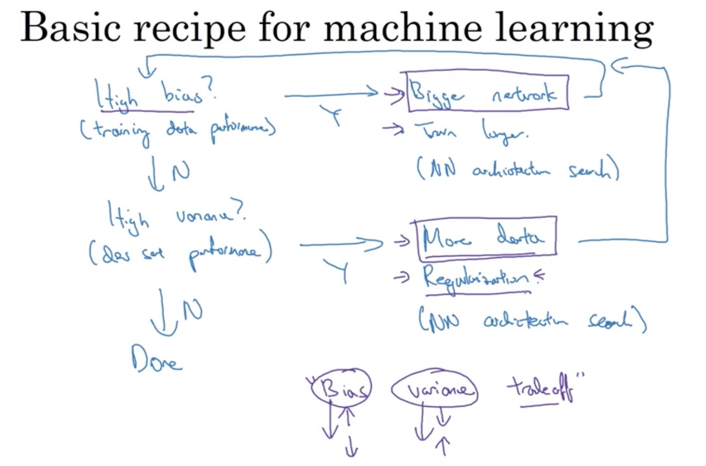

#### Bias and Variance

In the case of cat Classification:

| Train set error  | Test set error | Feedback |
| ------------- |:-------------:| -----:|
| 1% | 11% | Low bias, high variance |
| 15% | 16% | High bias, low variance |
| 15% | 30% | high bias, high variance|
| 0.1% | 1%| Low bias, low variance |

Human error $\approx 0$.

#### Basic "recipe" for machine learning

#### Regularization

**For logistic regression:**

The optimization problem is: $min_{w,b} J(w,b)$

${J(w,b) = \frac{1}{m} \sum_{i=1}^mL(\hat y ^ {(i)}, y^{(i)}) + Reg Term}$

L1 Regularization: ${RegTerm = \frac{\lambda}{m}||w||}$  
L2 Regularization: ${RegTerm = \frac{\lambda}{2m}||w||^2 = \frac{\lambda}{2m}w^Tw}$

L1: sparse of coefficients; help compress the model.
L2: more oftenly used.

$\lambda$: Regularization parameter.

**For neural network**

L2 Regularization:

${J(w^{[1]},b^{[1]},...,w^{[L]},b^{[L]}) = \frac{1}{m} \sum_{i=1}^mL(\hat y ^ {(i)}, y^{(i)}) + \frac{\lambda}{2m}\sum_{l=1}^L||w^{[l]}||^2}$

Where, ${||w^{[l]}||^2 = \sum_{i=1}^{n^{[l-1]}} \sum_{j=1}^{n^{[l]}} (w_{ij}^{[l]})^2}$, called *Frobenius Norm*.

Weight decay.

**Result of L2**:
* Keeps weight small unless the error derivative is very large.
* Prevent from fitting sampling error.
* Smoother model (output changes slower as the input change).
* If network has two similar inputs, it prefers to put half the weight on each rather than all the weight on one.

#### Dropout
Randomly remove some nodes in the network (along with incoming and outgoing edges).

Notes:
* Usually p >= 0.5
* Input layers *p* should be much higher (and use noise instead of dropout)
* Most deep learning frameworks come with a dropout layer
