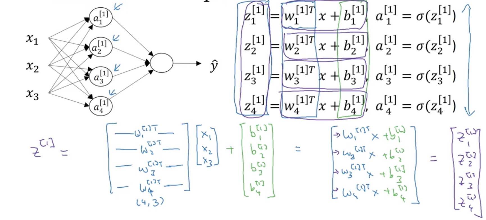

#Shallow and deep neural networks

#### The layers of neural nets

${z^{[1]} = W^{[1]}x + b^{[1]} \Longleftrightarrow a^{[1]} = \sigma(z^{[1]}) }$

${\Longleftrightarrow z^{[2]} = W^{[2]}a^{[1]} + b^{[2]} \Longleftrightarrow a^{[2]} = \sigma(z^{[2]}) }$

${...}$

#### Neural nets representation

Input layer, Hidden layer(s), Output layer

Notation ${a^{[l]}_i}$: the node $i$ in layer $l$.

At layer $i$ we have:

${z^{[i]} = W^{[i]}a^{[i-1]} + b^{[i]}; a^{[i]} = \sigma(z^{[i]})}$

${z^{[0]} := x}$

The shape of the weight matrix $W^{[i]}$ is (# of nodes in layer $i$, # of nodes in layer $i-1$).

#### vectorizing across multiple training examples

Notation: ${a^{[i](j)}}$ corresponds to the example $j$ in layer $i$.

The code snippet to be vectorized is:

`for i = 1 to m:`  
${\qquad z^{[1](i)} = W^{[1]}x^{(i)} + b^{[1]}}$  
${\qquad a^{[1](i)} = \sigma(z^{[1](i)})}$  
${\qquad z^{[2](i)} = W^{[2]}a^{[1](i)} + b^{[2]}}$  
${\qquad a^{[2](i)} = \sigma(z^{[2](i)})}$  
